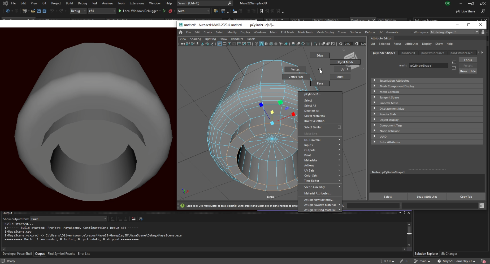
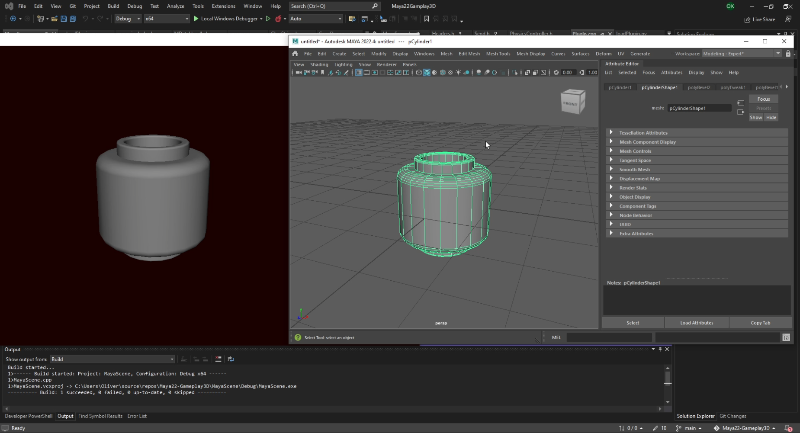
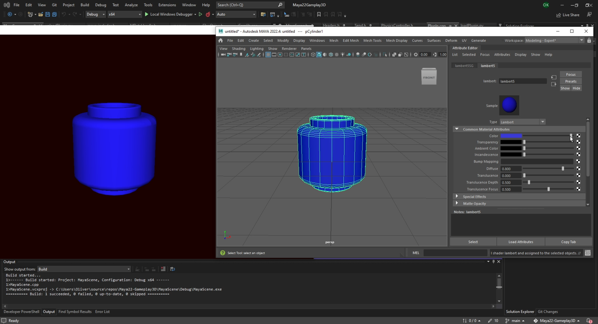
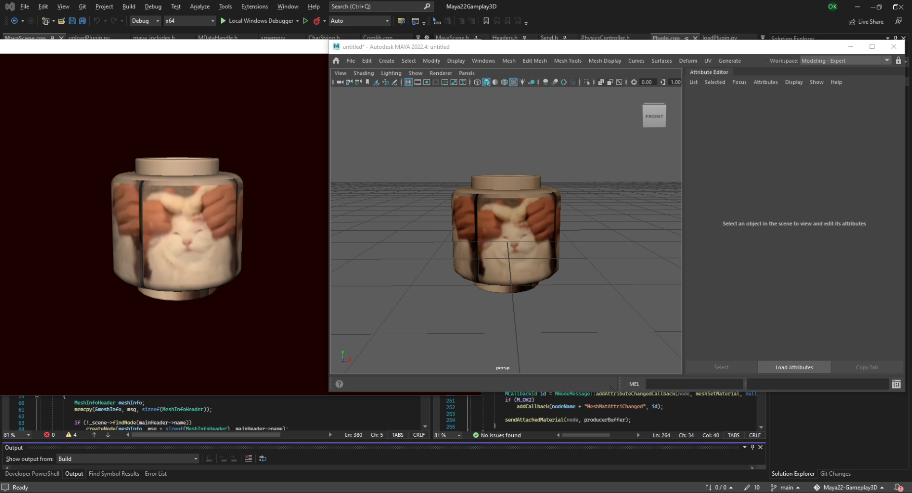

This project was an assignment in a course at Blekinge Institute of Technology.
Creatos: 
* Oliver Klingspor ([Olowerr](https://github.com/Olowerr))
* Adam Åkesson ([Simadra](https://github.com/Simadra))

The visual studio solution consists of two projects. A Maya22 plugin and a Gameplay3D scene.
By following the instructions below, one can model inside Maya while viewing the scene directly in Gameplay3D.
Allowing the user to see the model directly with the game engine's shading.

Make sure to read through the whole file before continuing :)

Requirements:
Maya22
Python 3.10 (installed from Microsoft Store)

Note:
Before building a project, make sure the latest Platform Toolset are set:
(right click the project -> Properties -> Configuration Properties -> General -> Platform Toolset)

What you have to do to run the program:

1. Navigate to and open gameplay.sln (MayaScene/GamePlay-master/)

2. Build the gameplay project. Once it's finished, close visual studio

3. Start Maya22 and run the mel command:
commandPort -n ":1234"

4. Open Maya22Gamplay3D.sln

5. Go into loadPlugin.py (inside MayaAPI - Resource Files)
and change the path on the "s.send" line to your path inside the directory, ending with:
"/MayaPlugin/build/x64/Debug/UD1447Project.mll".
Make sure the slashes are forward-slashes and no spaces exist.
There exist multiple example paths in loadPlugin.py for clarity.

6. Build the "MayaAPI" to run the plugin and press "Allow" in the Maya popup window.

7. Set MayaScene as the startup project and start it
(right click the project -> Set as Startup Project) 

8. Enjoy :)

EXTRA NOTES:
If you want to start the plugin "MayaAPI" while "MayaScene" is already running you have to go into:
maya -> Windows - > Settings/Preferences -> Plug in Manager
And search for the UD1447Project.mll file located inside:
"MayaPlugin/build/x64/Debug/"
Remember that you will need to build the "MayaAPI" first to get the file to start with.

It's possible to start the plugin manually (without Python)
but the Build Events in MayaAPI has to be cleared
and you'll need to first build MayaAPI then go into:
maya -> Windows - > Settings/Preferences -> Plug in Manager
And search for the UD1447Project.mll file located inside:
"/MayaPlugin/build/x64/Debug/"

